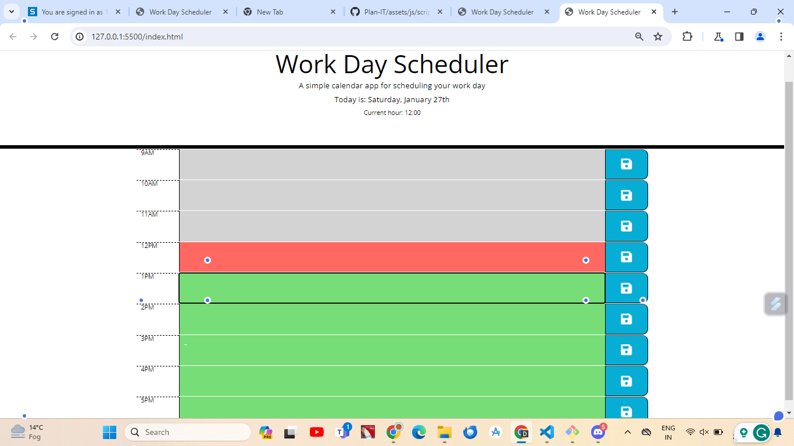

# Time-Planner

The Time Planner App is a simple web application that allows users to plan and organize their daily schedule. It provides a user-friendly interface to manage events and appointments throughout the day.

## Features

Display the current day at the top of the planner.
Color-code each timeblock based on past, present, and future.
Allow users to enter events by clicking on timeblocks.
Save events in local storage.
Persist events between page refreshes.

## Technologies Used

- HTML
- CSS
- JavaScript
- jQuery

## Usage

- When the app is opened, the current day will be displayed at the top of the planner.
- Scroll down to view the timeblocks for standard business hours.
- Each timeblock will be color-coded to indicate whether it is in the past, present, or future.
- To enter an event, click on the desired timeblock and enter the event details.
- Click the save button in the timeblock to save the event in local storage.
- The saved events will persist between page refreshes.

## License

This project is licensed under the MIT License.

## Installation

- Clone the repository:

git clone https://github.com/teddwill123/Time-Planner.git

